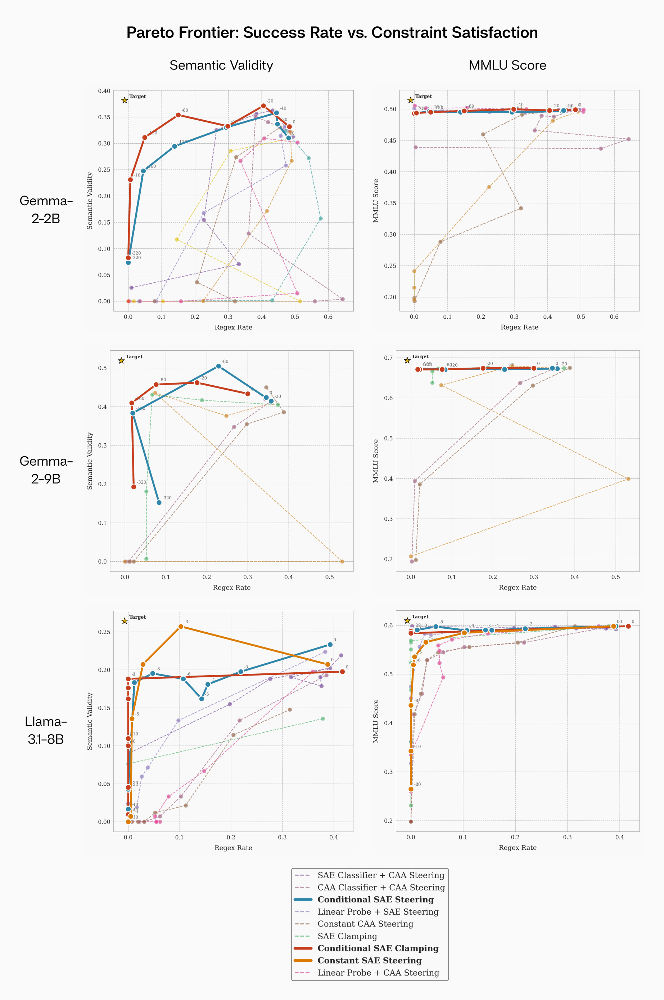

# Sieve: Steering for Fine-grained Regex Control

Sieve is a simple framework for applying targeted interventions to language models using Sparse Autoencoder (SAE) techniques. It enables precise control over model behavior through feature-level manipulations. 

Read the full case study on Sieve's application and results on our blog [here](https://www.tilderesearch.com/blog/sieve).

## Results

Our experiments demonstrate Pareto dominance of SAE-based methods on fine-grained control. Below are the Pareto frontiers across models.



## Quick Start

You will have to install flash attention separately. Without flash attention, the model will fall back to eager.

```bash
# Install flash attention
pip install wheel
pip install flash-attn --no-build-isolation
```

```bash
# Install package
pip install -e .

# Run regex interventions example
python src/regex_interventions.py
```

Use `pip install -e .` rather than `pip install -r requirements.txt`, as it simplifies using imports and makes it easier to add tests.

Then run `python src/regex_interventions.py`. You can change settings in `src/eval_config.py`.

This will:

1. Load a pre-trained model and SAE
2. Run baseline code generation
3. Apply various interventions to control regex usage
4. Evaluate and compare results

It can be used to directly reproduce reported results.

## Runtime & Parallelization

This is a parameter sweep across multiple intervention methods and scales, which can take significant time to run. With 200 generations per evaluation method, each method takes approximately 8 hours to complete on a single GPU. Probe methods take longer, as they require generating data and then training probes.

However, the evaluation can be parallelized by taking the following steps:

1. Split the intervention methods across multiple GPUs
2. Run separate jobs with different subsets of `intervention_types` in `eval_config.py`
3. Save results to different output files (e.g., `results_gpu1.json`, `results_gpu2.json`)

The visualization notebooks (`view_run_results.ipynb`) are designed to handle multiple result files, allowing you to combine outputs from parallel runs for analysis. You can also reduce the number of generations per method to speed up evaluation.

MMLU evaluations, by contrast, are much shorter and complete in roughly 1-2 hours for all methods.

## Overview

Sieve provides tools for:

- Loading and applying pre trained SAEs
- Performing targeted feature interventions
- Analyzing activation patterns
- Evaluating intervention effects

The framework supports multiple intervention types:

1. **Constant SAE**: Direct feature manipulation
2. **Conditional SAE**: Activation-dependent interventions
3. **Contrastive Activations (CAA)**: Steering vectors
4. **Probe-based**: Linear probes

### InterventionWrapper

The main interface for applying interventions:

```python
from src.wrapper import InterventionWrapper

# Initialize wrapper
wrapper = InterventionWrapper(model_name="google/gemma-2b-it")

# Load SAE
wrapper.load_sae(release="gemma-scope-2b-pt-res", sae_id="layer_8/width_16k/average_l0_71", layer_idx=8)

# Generate with intervention
output = wrapper.generate(prompt, intervention_type="CONDITIONAL_PER_TOKEN", scale=1.0)
```

### Evaluation Tools

- `regex_interventions.py`: Test regex usage patterns (this is the main file for reproducing results)
- `count_activations.py`: Analyze performance for different kidns of classifiers (SAE encoder vectors, CAA vectors, linear probes)
- `agent_eval.py`: Evaluate generation quality

## Configuration

Modify settings in `src/eval_config.py`:

```python
class EvalConfig:
    model_name: str = "google/gemma-2b-it"
    intervention_types: list = [
        "CONSTANT_SAE",
        "CONDITIONAL_PER_TOKEN",
        "CONDITIONAL_PER_INPUT",
        "CONSTANT_STEERING_VECTOR"
    ]
```
The eval config can be used to change the prompt, intervention scales, base model, etc. appropriately as well. However, to change the SAE features used, you have to modify `utils.py` to change the feature indices and layer. The layer 8 llama feature is currently commented out. 

## Project Structure

```
sieve/
├── src/
│   ├── agent_eval.py     # LLM-based evaluation tools
│   ├── caa.py           # Contrastive Activation Addition core
│   ├── count_activations.py  # Probe analysis tools
│   ├── regex_interventions.py  # Main entry point
│   ├── wrapper.py      # Core intervention framework
│   ├── eval_config.py  # Configuration settings
│   └── utils.py        # Helper functions
│
├── mmlu_evals.py       # MMLU benchmark evaluation script
├── view_activations.ipynb    # Notebook for activation analysis
├── view_run_results.ipynb    # Notebook for experiment results
├── pyproject.toml      # Package configuration
└── README.md
```

## Collaboration

Sieve is a collaboration between Tilde and Adam Karvonen, leveraging:

- GemmaScope pretrained SAEs [1]
- Custom code-specific SAEs for Llama models
- Advanced intervention techniques

## Citation

If you use Sieve or any of its results in your research, please cite:

```bibtex
@article{karvonen2024sieve,
    title={Sieve: SAEs Beat Baselines on a Real-World Task (A Code Generation Case Study)},
    author={Karvonen, Adam and Pai, Dhruv and Wang, Mason and Keigwin, Ben},
    journal={Tilde Research Blog},
    year={2024},
    month={12},
    url={https://www.tilderesearch.com/blog/sieve},
    note={Blog post}
}
```

For the GemmaScope pretrained SAEs, please cite:

```bibtex
@misc{lieberum2024gemmascopeopensparse,
      title={Gemma Scope: Open Sparse Autoencoders Everywhere All At Once on Gemma 2},
      author={Tom Lieberum and Senthooran Rajamanoharan and Arthur Conmy and Lewis Smith and Nicolas Sonnerat and Vikrant Varma and János Kramár and Anca Dragan and Rohin Shah and Neel Nanda},
      year={2024},
      eprint={2408.05147},
      archivePrefix={arXiv},
      primaryClass={cs.LG},
      url={https://arxiv.org/abs/2408.05147},
}
```

[1] Lieberum et al., "Gemma Scope: Open Sparse Autoencoders Everywhere All At Once on Gemma 2", 2024

## License

MIT License

Copyright (c) 2024 Tilde Research and Adam Karvonen
